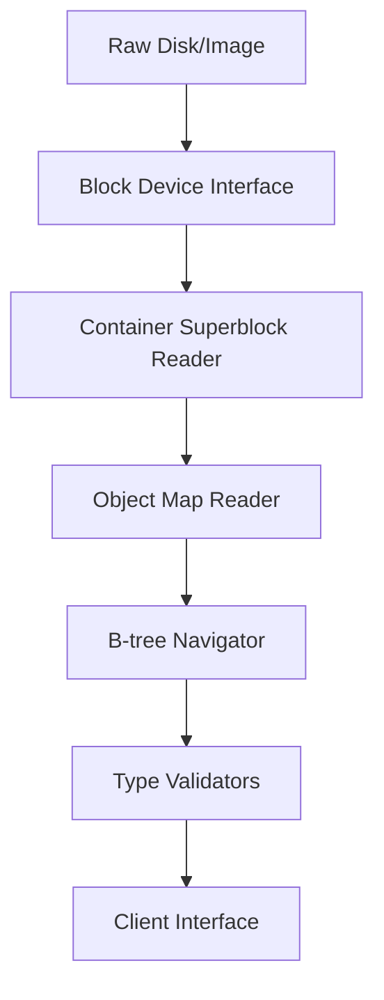
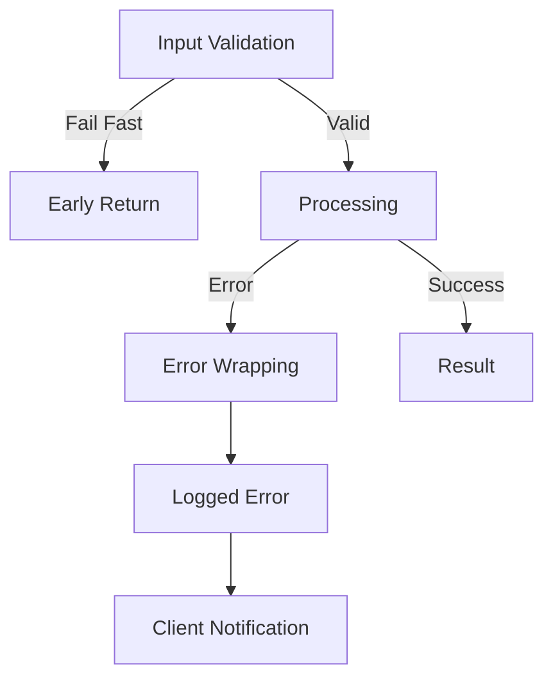
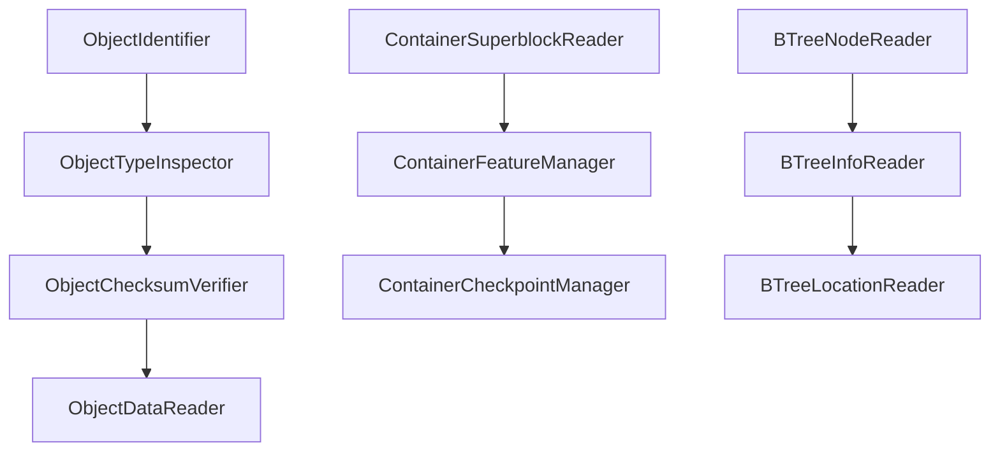
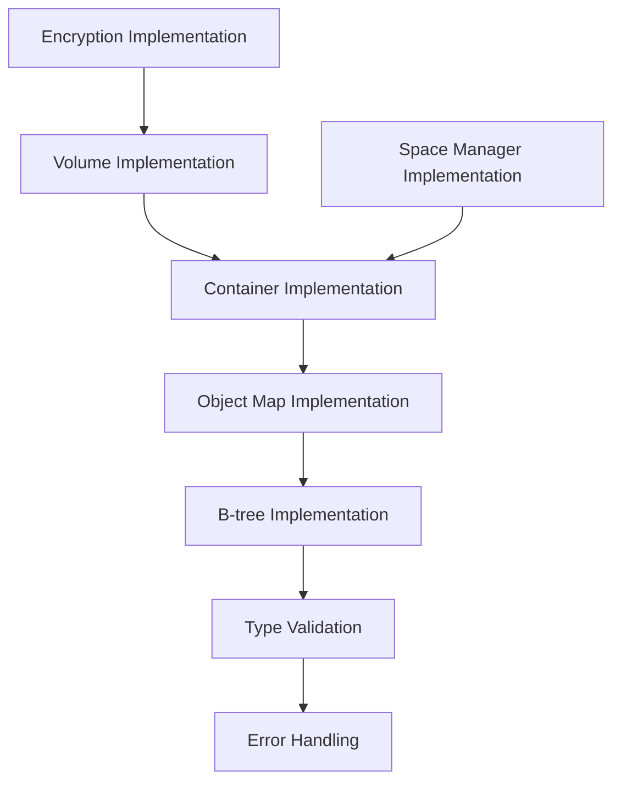

# Go-APFS Project Architecture

## Overview

Go-APFS is a cross-platform, read-only implementation for parsing and exploring Apple File System (APFS) volumes directly from raw disk structures. The project is built with clean architecture principles emphasizing separation of concerns, interface segregation, and the DRY principle.

## Core Principles

The architecture follows these coding principles:

- **Single Source of Truth (SSOT)**: Type definitions are centralized in `internal/types/`
- **Interface Segregation**: Highly focused interfaces in `internal/interfaces/`
- **Separation of Concerns**: Clear separation between data structures, business logic, and I/O
- **DRY (Don't Repeat Yourself)**: Common patterns are abstracted into reusable components
- **YAGNI (You Aren't Gonna Need It)**: Only implements features that are currently needed
- **Fail-Fast**: Input validation and error handling at boundaries

## Project Structure

```
go-apfs/
├── cmd/                           # Command-line interface (minimal implementation)
│   └── root.go                    # Root command structure
├── internal/                      # Private implementation packages
│   ├── interfaces/                # Interface definitions (ISP compliance)
│   │   ├── btree.go              # B-tree operation interfaces
│   │   ├── container.go          # Container management interfaces
│   │   ├── data_streams.go       # Data stream interfaces
│   │   ├── efi_jumpstart.go      # EFI jumpstart interfaces
│   │   ├── encryption.go         # Encryption interfaces
│   │   ├── encryption_rolling.go # Rolling encryption interfaces
│   │   ├── extended_fields.go    # Extended field interfaces
│   │   ├── file_system_objects.go# File system object interfaces
│   │   ├── fusion.go             # Fusion drive interfaces
│   │   ├── object_map.go         # Object mapping interfaces
│   │   ├── objects.go            # Core object interfaces
│   │   ├── reaper.go             # Reaper interfaces
│   │   ├── sealed_volumes.go     # Sealed volume interfaces
│   │   ├── siblings.go           # Sibling link interfaces
│   │   ├── snapshot.go           # Snapshot interfaces
│   │   ├── space_manager.go      # Space management interfaces
│   │   └── volumes.go            # Volume interfaces
│   ├── types/                     # Data structure definitions (SSOT)
│   │   ├── general_types.go      # Basic types (Paddr, UUID, etc.)
│   │   ├── container.go          # Container-layer structures
│   │   ├── btree.go              # B-tree structures
│   │   ├── objects.go            # Object type definitions
│   │   ├── volumes.go            # Volume structures
│   │   ├── encryption.go         # Encryption structures
│   │   ├── encryption_rolling.go # Rolling encryption structures
│   │   ├── data_streams.go       # Data stream structures
│   │   ├── efi_jumpstart.go      # EFI jumpstart structures
│   │   ├── extended_fields.go    # Extended field structures
│   │   ├── file_system_objects.go# File system object structures
│   │   ├── fusion.go             # Fusion drive structures
│   │   ├── object_maps.go        # Object map structures
│   │   ├── reaper.go             # Reaper structures
│   │   ├── sealed_volumes.go     # Sealed volume structures
│   │   ├── siblings.go           # Sibling link structures
│   │   ├── snapshot.go           # Snapshot structures
│   │   └── space_manager.go      # Space manager structures
│   └── apfs/                      # Implementation layer
│       ├── btrees/               # B-tree implementations
│       │   ├── btree_info_reader.go
│       │   ├── btree_node_reader.go
│       │   ├── btree_location_reader.go
│       │   ├── btree_kv_location_reader.go
│       │   ├── btree_kv_offset_reader.go
│       │   └── btree_index_node_value_reader.go
│       ├── container/            # Container implementations
│       │   ├── container_superblock_reader.go
│       │   ├── container_feature_manager.go
│       │   ├── container_flag_manager.go
│       │   ├── container_checkpoint_manager.go
│       │   ├── container_ephemeral_manager.go
│       │   ├── container_statistics_reader.go
│       │   ├── checkpoint_map_reader.go
│       │   ├── checkpoint_mapping_reader.go
│       │   └── evict_mapping_reader.go
│       ├── data_streams/         # Data stream implementations
│       ├── encryption/           # Encryption implementations
│       ├── encryption_rolling/   # Rolling encryption implementations
│       ├── efi_jumpstart/        # EFI jumpstart implementations
│       ├── extended_fields/      # Extended field implementations
│       ├── fusion/               # Fusion drive implementations
│       ├── object_maps/          # Object map implementations
│       ├── objects/              # Object implementations
│       ├── reaper/               # Reaper implementations
│       ├── sealed_volumes/       # Sealed volume implementations
│       ├── siblings/             # Sibling link implementations
│       ├── snapshot/             # Snapshot implementations
│       ├── space_manager/        # Space manager implementations
│       ├── volumes/              # Volume implementations
│       ├── architecture.md       # This file
│       ├── outline.md           # Detailed implementation outline
│       └── Apple-File-System-Reference.pdf # Official Apple specification
├── docs/                         # Documentation
├── main.go                       # Application entry point
├── go.mod                        # Go module definition
└── README.md                     # Project overview
```

## Architectural Layers

### 1. Interface Layer (`internal/interfaces/`)

This layer defines contracts that promote interface segregation and testability. Each interface file focuses on a specific domain:

- **Core Object Interfaces** (`objects.go`): Fundamental object operations
- **Container Interfaces** (`container.go`): Container-level operations
- **Volume Interfaces** (`volumes.go`): Volume-level operations
- **B-tree Interfaces** (`btree.go`): B-tree navigation and manipulation
- **Encryption Interfaces** (`encryption.go`, `encryption_rolling.go`): Cryptographic operations
- **Space Management Interfaces** (`space_manager.go`): Free space tracking
- **Specialized Interfaces**: Domain-specific contracts for features like fusion drives, snapshots, etc.

**Key Principles:**
- Interface Segregation: Clients depend only on methods they use
- High cohesion: Related methods are grouped together
- Dependency Inversion: Implementations depend on abstractions

### 2. Type Layer (`internal/types/`)

This layer serves as the Single Source of Truth for all data structures, directly mapping to the Apple File System Reference specification:

- **General Types** (`general_types.go`): Basic primitives (Paddr, UUID, Prange)
- **Container Types** (`container.go`): Container superblock and related structures
- **Object Types** (`objects.go`): Core object headers and type definitions
- **B-tree Types** (`btree.go`): B-tree node and key-value structures
- **Volume Types** (`volumes.go`): Volume superblock and metadata
- **Specialized Types**: Feature-specific structures following APFS specification

**Key Principles:**
- SSOT: All type definitions are centralized
- Immutable by design: Types represent on-disk structures
- Validation methods: Built-in data integrity checks
- Fail-fast validation: Early detection of invalid data

### 3. Implementation Layer (`internal/apfs/`)

This layer provides concrete implementations of the interfaces, organized by functional domain:

#### Container Implementation (`internal/apfs/container/`)
- **Superblock Reader**: Parses and validates container superblocks
- **Feature Manager**: Handles optional container features
- **Checkpoint Manager**: Manages checkpoint areas and data
- **Statistics Reader**: Extracts container-level statistics
- **Evict Mapping**: Handles block relocation for fusion drives

#### B-tree Implementation (`internal/apfs/btrees/`)
- **Node Reader**: Parses B-tree nodes
- **Info Reader**: Extracts B-tree metadata
- **Location Reader**: Handles node location and addressing
- **Key-Value Readers**: Parse key-value pairs and offsets
- **Index Node Reader**: Handles index node values

**Key Principles:**
- Single Responsibility: Each component has one reason to change
- Open/Closed: Extensible without modification
- Defensive Programming: Comprehensive input validation
- Error Propagation: Clear error handling and reporting

## Data Flow Architecture

### Read Operations



1. **Input Layer**: Raw disk data or image files
2. **Block Device Layer**: Abstracted block-level I/O
3. **Container Layer**: Container superblock parsing and validation
4. **Object Resolution**: Object map traversal and resolution
5. **B-tree Navigation**: Tree structure traversal
6. **Type Validation**: Data integrity verification
7. **Client Interface**: Clean API for consumers

### Error Handling Strategy



- **Fail-Fast**: Invalid inputs are rejected immediately
- **Error Wrapping**: Context is added at each layer
- **Graceful Degradation**: Partial data is still useful
- **Comprehensive Logging**: All errors are recorded for debugging

## Component Relationships

### Interface Dependencies



### Implementation Dependencies



## Design Patterns Used

### 1. Reader Pattern
All data access follows a consistent reader pattern:
- Immutable data structures
- Validation on construction
- Clear error propagation
- Lazy evaluation where appropriate

### 2. Interface Segregation Pattern
Large interfaces are broken into focused, cohesive contracts:
- Single-purpose interfaces
- Composable through embedding
- Testable in isolation
- Clear dependency relationships

### 3. Factory Pattern
Object creation is centralized:
- Consistent validation
- Error handling
- Resource management
- Type safety

### 4. Strategy Pattern
Different implementations for similar operations:
- Encryption algorithms
- Block device types
- Validation strategies
- Error handling approaches

## Testing Strategy

### Unit Tests
- Each implementation has corresponding tests
- Interface compliance verification
- Edge case handling
- Error condition testing

### Integration Tests
- End-to-end data flow validation
- Real APFS image testing
- Performance benchmarking
- Memory usage profiling

### Property-Based Testing
- Invariant verification
- Fuzz testing for parsers
- Data integrity checks
- Error resilience testing

## Performance Considerations

### Memory Management
- Streaming data processing
- Lazy evaluation
- Resource pooling
- Garbage collection optimization

### I/O Optimization
- Block-aligned reads
- Read-ahead strategies
- Caching frequently accessed data
- Minimal memory copying

### Concurrency Safety
- Immutable data structures
- Read-only operations
- Thread-safe interfaces
- No shared mutable state

## Security Considerations

### Input Validation
- All external data is validated
- Buffer overflow protection
- Integer overflow checks
- Malformed data handling

### Encryption Support
- Key material protection
- Secure memory handling
- Cryptographic verification
- Side-channel resistance

### Error Information
- Sensitive data not exposed in errors
- Consistent error messages
- No timing attacks
- Audit trail maintenance

## Extension Points

### Adding New Object Types
1. Define type structures in `internal/types/`
2. Create interfaces in `internal/interfaces/`
3. Implement readers in `internal/apfs/`
4. Add validation and tests

### Supporting New Features
1. Update type definitions
2. Extend relevant interfaces
3. Implement feature handlers
4. Update documentation

### Performance Optimizations
1. Add caching layers
2. Implement parallel processing
3. Optimize memory usage
4. Profile and benchmark

## Future Architecture Goals

### Modularization
- Plugin architecture for features
- Dynamic loading capabilities
- Versioned interfaces
- Backward compatibility

### Performance
- Zero-copy operations
- Memory-mapped I/O
- Concurrent processing
- Streaming APIs

### Observability
- Metrics collection
- Distributed tracing
- Performance profiling
- Health monitoring

## Development Guidelines

### Code Organization
- One concept per file
- Clear naming conventions
- Consistent error handling
- Comprehensive documentation

### Interface Design
- Small, focused interfaces
- Composable contracts
- Clear responsibilities
- Minimal dependencies

### Implementation Patterns
- Fail-fast validation
- Defensive programming
- Clear error messages
- Consistent return patterns

### Testing Requirements
- Unit tests for all public methods
- Integration tests for workflows
- Benchmark tests for performance
- Property tests for invariants

---

This architecture promotes maintainability, testability, and extensibility while following established software engineering principles. The clear separation of concerns and interface-driven design enables confident modifications and additions to the codebase.
